# MacOS FPGA Toolchain Demo (in progress)

## About
#### This is my personal compilation of FPGA development toolchain for MacOS.
#### This project is not completed because I used the Xilinx Nexys A7 and currently there are  no tools that can generate bitstream for this board on MacOS. However, many other boards already had their support from [F4PGA](https://github.com/f4pga) and I am also waiting for them to support the Nexys A7 with their [prjxray](https://github.com/f4pga/prjxray) project. Please read this document as reference as you may need to change the suitable bitstream generation tool for yourself.
#### Afterall, the only missing piece is the tool that support my case, my Nexys A7 board, to generate the .bit file. After that, I can totally upload the .bit file to the board.

## Workflow and Installation
### Write code using Vim with [Verilog syntax](https://github.com/vhda/verilog_systemverilog.vim)
#### Installation
##### Using vim-plug

```VimL
Plug 'vhda/verilog_systemverilog.vim'
:PlugInstall
```

#### Demo

```
vim ALU_design.v
```

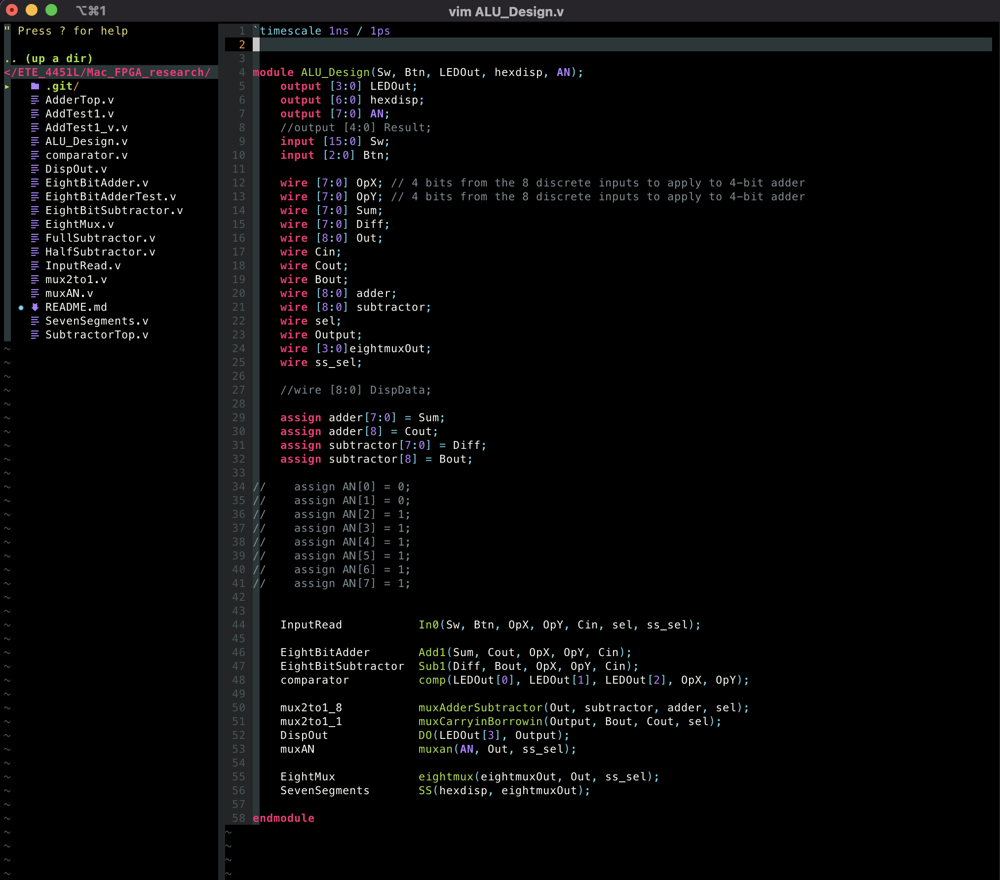

### Compile code with [Icarus Verilog](https://github.com/steveicarus/iverilog)
#### [Installation](https://iverilog.fandom.com/wiki/Installation_Guide)
##### Using homebrew

```
brew install icarus-verilog
```

#### [Demo](https://iverilog.fandom.com/wiki/Getting_Started)
##### Compile file(s)

```
iverilog -o <name of result file> <file1.v> <file2.v> <file3.v>
```

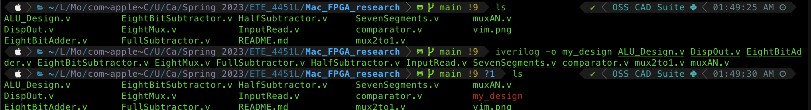

##### or put all verilog file into one text file called 'file_list.txt'
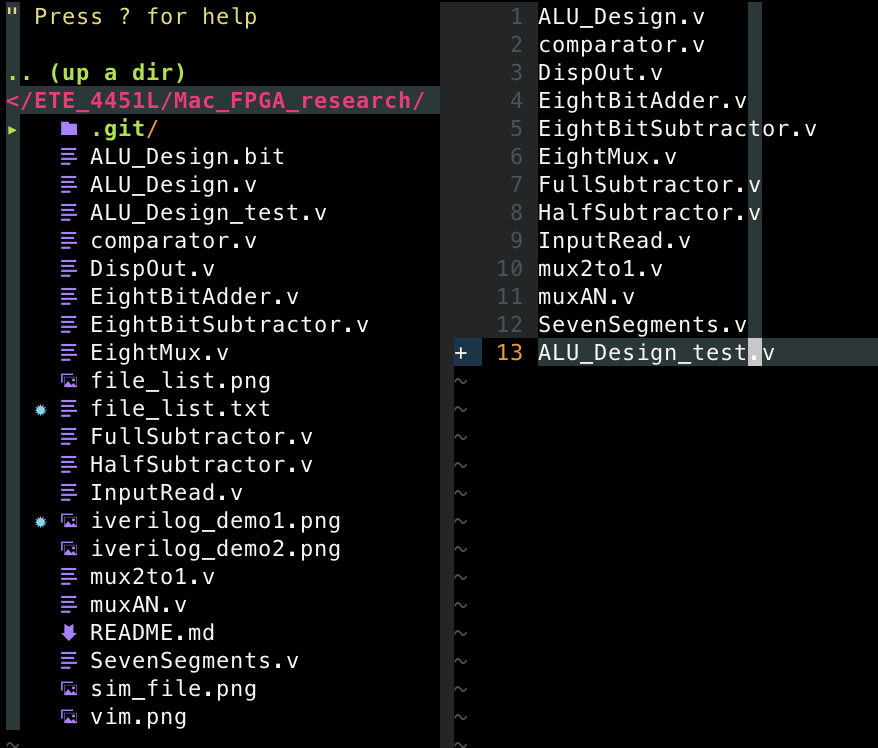

```
iverilog -o <name of result file> -c file_list.txt
```

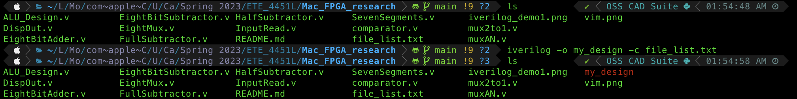

#### Run Simulation
##### Note: remember to put the name of simulation file in test verilog file in follow format:
```
$dumpfile(<name of simulation file.vcd>);
$dumpvars;
```
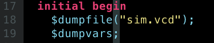
##### then run the following command to generate .vcd file
```
vvp <name of result file>
```
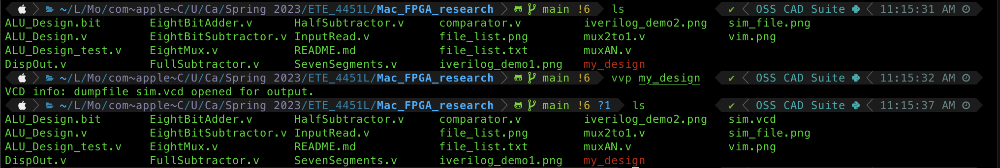

### Demo Simulation with VSCode or GTKwave
#### Installation
##### Option 1: Using VSCode by following this [instruction](https://code.visualstudio.com/docs/setup/mac#:~:text=Drag%20Visual%20Studio%20Code.app,choosing%20Options%2C%20Keep%20in%20Dock.), then install the [TerosHDL extension](https://marketplace.visualstudio.com/items?itemName=teros-technology.teroshdl) or [WaveTrace extention](https://marketplace.visualstudio.com/items?itemName=wavetrace.wavetrace)
##### Option 2: Using gtkwave using brew
```
brew install --cask gtkwave
```
#### Demo
##### Option 1: Open .vcd file using VSCode
###### Using TerosHDL: Open VSCode using the following command then right click on .vcd file, select "Open with waveform viewer"
```
code .
```
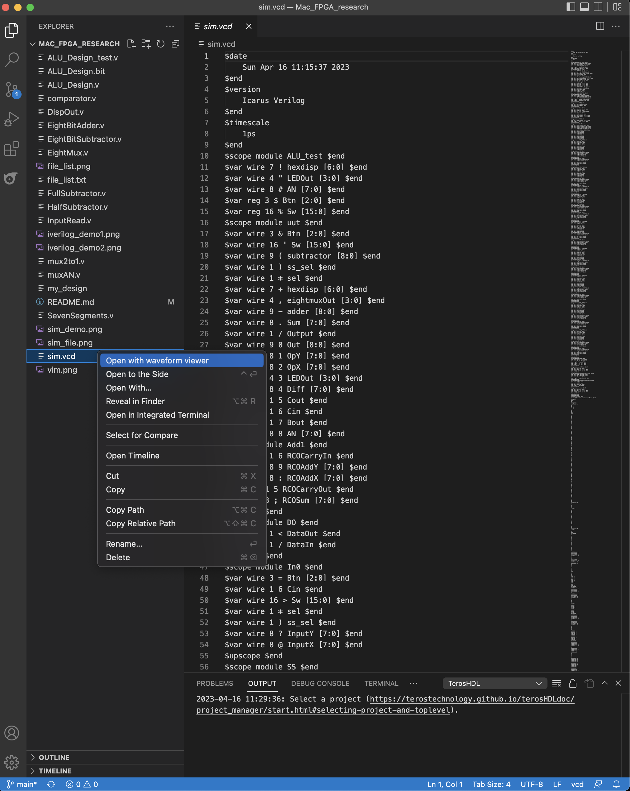
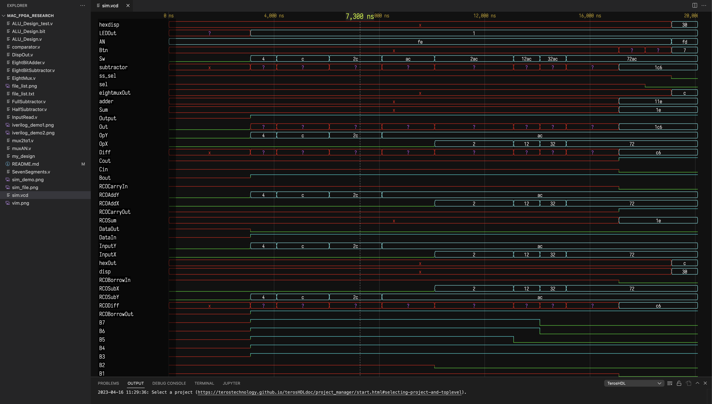
###### Using WaveTrace, this will run automatically, but the free version only show up to 8 variables
```
code sim.vcd
```
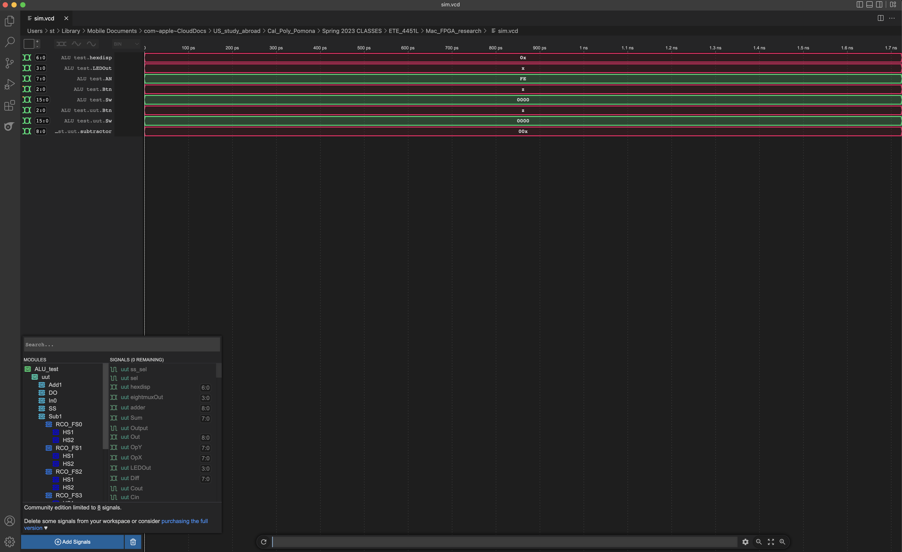
##### Option 2: Open .vcd file using GTKwave
```
open -a gtkwave
```
###### Select 'File' -> 'Open New Tab' -> select .vcd file
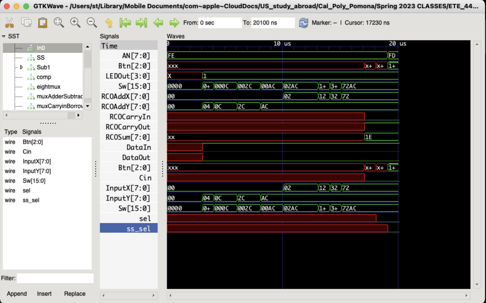

### Synthesis with [Yosys](https://yosyshq.net/yosys/)
#### [Installation](https://github.com/YosysHQ/yosys)
##### Read more about OSS CAD Suite by YosysHQ [here](https://github.com/YosysHQ/oss-cad-suite-build)
##### Go to this [OSS CAD Suite release link](https://github.com/YosysHQ/oss-cad-suite-build/releases) and download your compatible version then extract it
##### For MacOS
```
cd <extracted_location/oss-cad-suite>
./activate
cd ~
source <extracted_location>/oss-cad-suite/environment
```
##### The last command only makes the environment of OSS CAD Suite available for current session, to make it always available please add the command to your shell script (zshrc)
##### Start yosys console
```
yosys
```
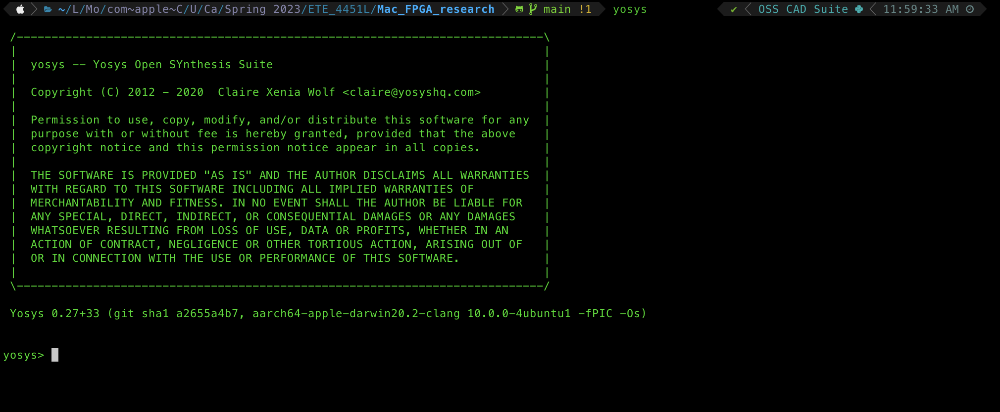
##### Here are some commands I use for synthesis, have to be in this sequence
```
#read design
read_verilog <file1.v> <file2.v> <file3.v>
```
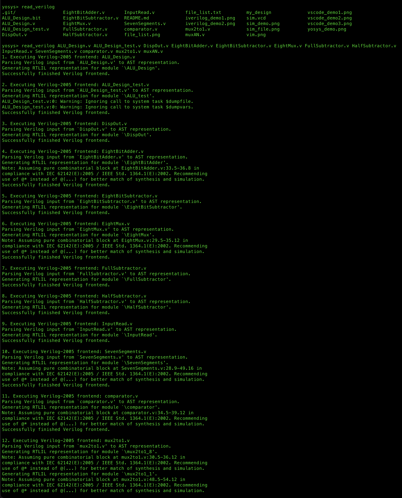
```
#elaborate design hierarchy
hierarchy -check -top <name of top verilog file>
```
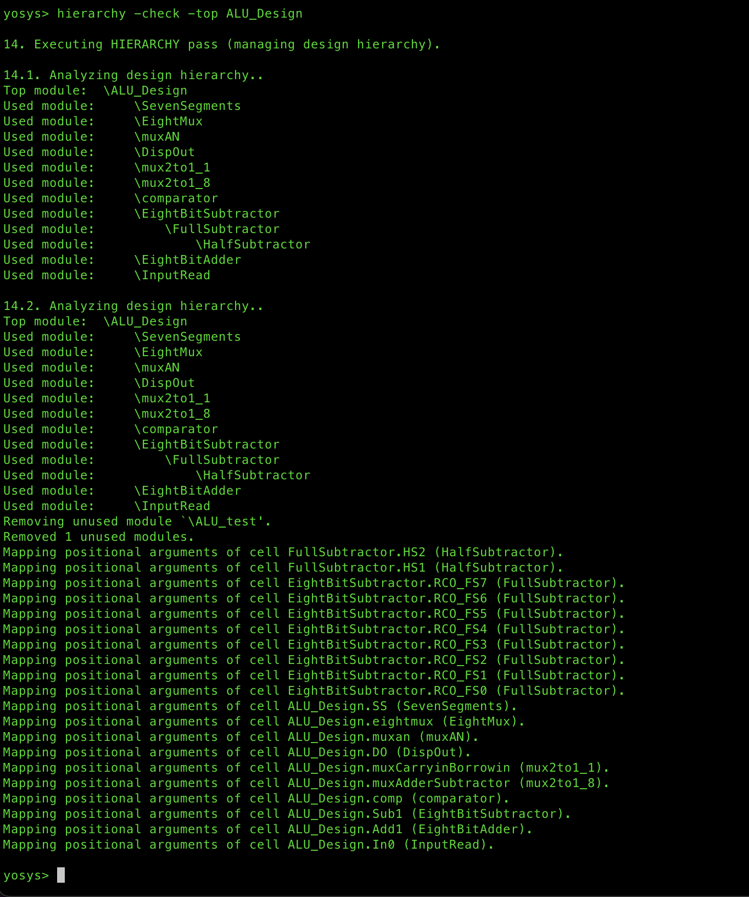
```
#the high-level stuff, each of them can be one command separately
proc; opt; fsm; opt; memory; opt
```
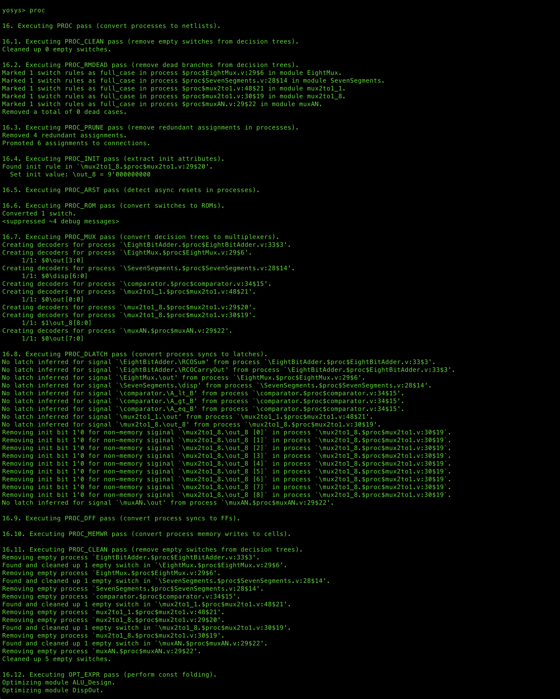

```
#write synthesized design
#this command generates synthesized_design.v file
write_verilog <name of synthesized_design.v>
```
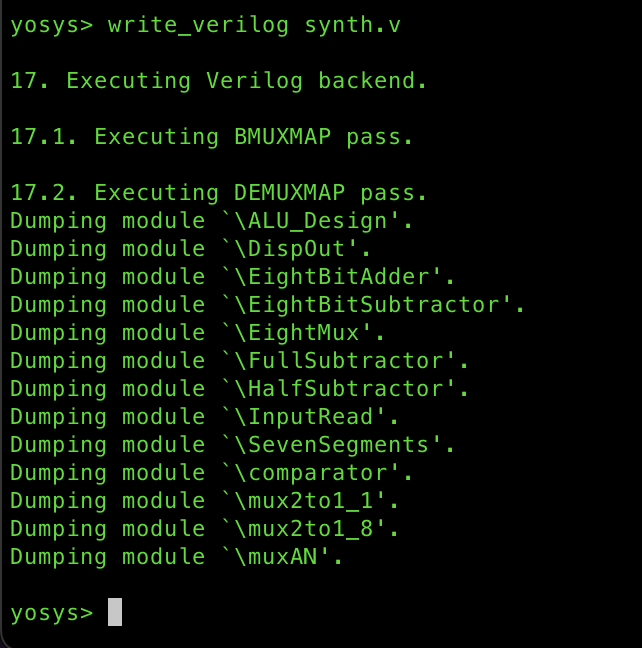
For more command information, please read this [YosysHQ link](https://yosyshq.net/yosys/)

### Generate RTL Schematic with graphviz or JSON file
#### Installation
##### Option 1: install graphviz
```
brew install graphviz
```
##### Option 2: install netlistsvg with npm
```
brew install node
npm install -g netlistsvg
```

#### Demo
##### Option 1: Using graphviz
##### Inside yosys console, run
```
show -format dot
```
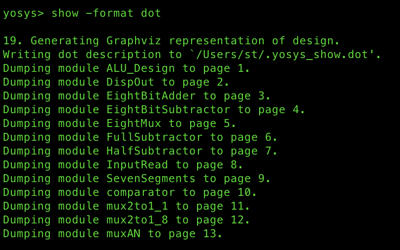
##### It will generate the hidden .dot file with the path to that file, just follow it to find the file as it will not show up in the current directory
##### I moved my .dot file to the this directory, then run the following command in my main shell
```
dot -Tpng <file.dot> -o <outputfile.png>
```
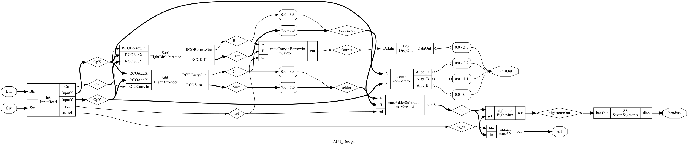

##### Option 2: Using JSON file
##### This is my favorite method because it generate more electronic looking of the schematic
##### Inside yosys console, run
```
write_json <input_json_file.json>
```
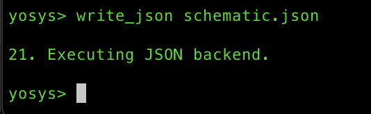

##### It will generate a JSON file right in the current directory so it is more convenient.
##### In the directory with the JSON file of the main shell, run
```
netlistsvg <input_json_file.json> -o <output_svg_file.svg>
```
##### Double click on the new generated .svg file
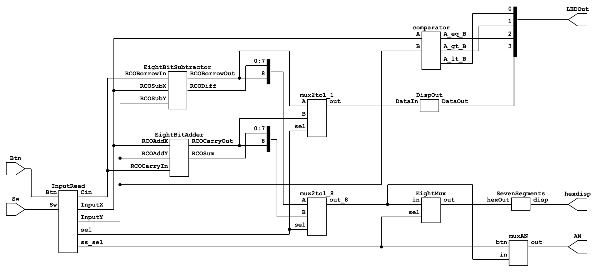

### Generate Bitstream (still in progress for Xilinx Nexys A7)
#### Please check [F4PGA](https://github.com/f4pga) for more information about other boards bitstream generation.
#### Currently, the only way to generate bitstream is to install a virtual machine of Ubuntu or Window on your Mac run Vivado on there to get the .bit file, which defeats the purpose of this research. Also, keep in mind that Vivado can only be installed on amd architecture, which means if you are using an M1 Mac just like me, there are no solutions yet.

### Upload the .bit file to the board with [openFPGALoader](https://github.com/trabucayre/openFPGALoader) (supposing you have a .bit file somehow)
#### In this part, I test by getting the .bit file from my Vivado on other PC.
#### Installation
```
brew install openfpgaloader
```

#### Demo
##### Run the following command to check if your board is supported
```
openFPGALoader --list-boards
```
##### Upload the .bit file to your board with 2 options
##### Simply replace my_fpga_board with your board name in the generated list after run the above command
```
#program to SRAM (faster but not persistent)
openFPGALoader -b my_fpga_board my_bitstream.bit

#flash (slower but persistent)
openFPGALoader -b my_fpga_board -f my_bitstream.bit
```
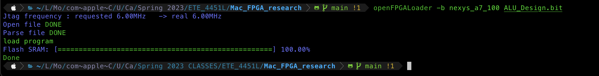
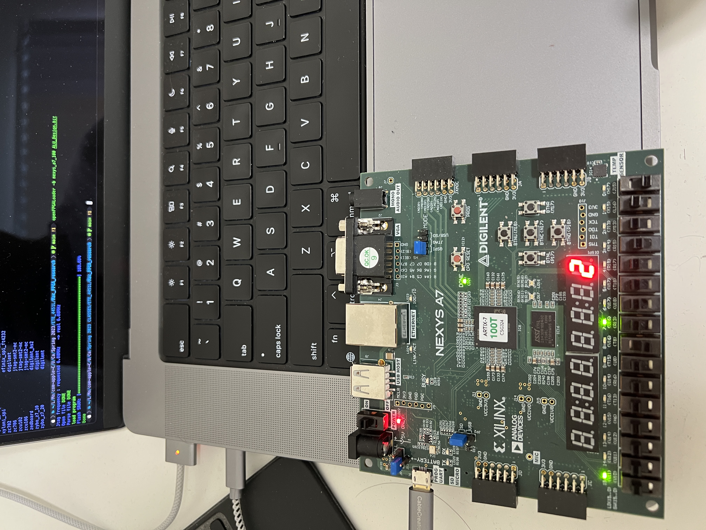
