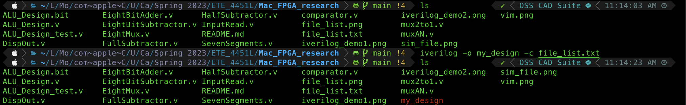

# MacOS FPGA Toolchain Demo (in progress)

## About

## Workflow and Installation
### Write code using Vim with [Verilog syntax](https://github.com/vhda/verilog_systemverilog.vim)
#### Installation
##### Using vim-plug

```VimL
Plug 'vhda/verilog_systemverilog.vim'
:PlugInstall
```

#### Demo

```
vim ALU_design.v
```


### Compile code with [Icarus Verilog](https://github.com/steveicarus/iverilog)
#### [Installation](https://iverilog.fandom.com/wiki/Installation_Guide)
##### Using homebrew

```
brew install icarus-verilog
```

#### [Demo](https://iverilog.fandom.com/wiki/Getting_Started)
##### Compile file(s)

```
iverilog -o <name of result file> <file1.v> <file2.v> <file3.v>
```


##### or put all verilog file into one text file called 'file_list.txt'


```
iverilog -o <name of result file> -c file_list.txt
```



#### Run Simulation
##### Note: remember to put the name of simulation file in test verilog file in follow format:
```
$dumpfile(<name of simulation file.vcd>);
$dumpvars;
```

##### then run the following command to generate .vcd file
```
vvp <name of result file>
```


### Demo Simulation with VSCode or GTKwave
#### Installation
##### Option 1: Using VSCode by following this [instruction](https://code.visualstudio.com/docs/setup/mac#:~:text=Drag%20Visual%20Studio%20Code.app,choosing%20Options%2C%20Keep%20in%20Dock.) then install the [TerosHDL extension](https://marketplace.visualstudio.com/items?itemName=teros-technology.teroshdl) or [WaveTrace extention](https://marketplace.visualstudio.com/items?itemName=wavetrace.wavetrace)
##### Option 2: Using gtkwave using brew
```
brew install --cask gtkwave
```
#### Demo
##### Option 1: Open .vcd file using VSCode
###### Using TerosHDL: Open VSCode using the following command then right click on .vcd file, select ""
```
code .
```


###### Using WaveTrace, this will run automatically, but the free version only show up to 8 variables
```
code sim.vcd
```


