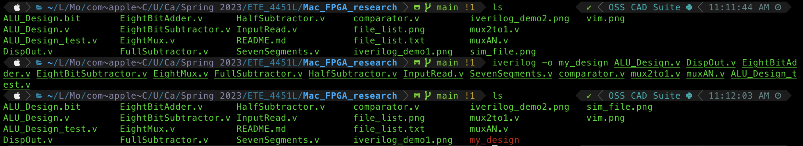

# MacOS FPGA Toolchain Demo (in progress)

## About

## Workflow and Installation
### Write code using Vim with [Verilog syntax](https://github.com/vhda/verilog_systemverilog.vim)
#### Installation
##### Using vim-plug

```VimL
Plug 'vhda/verilog_systemverilog.vim'
:PlugInstall
```

#### Demo

```
vim ALU_design.v
```


### Compile code with [Icarus Verilog](https://github.com/steveicarus/iverilog)
#### [Installation](https://iverilog.fandom.com/wiki/Installation_Guide)
##### Using homebrew

```
brew install icarus-verilog
```

#### [Demo](https://iverilog.fandom.com/wiki/Getting_Started)
##### Compile file(s)

```
iverilog -o <name of result file> <file1.v> <file2.v> <file3.v>
```



##### or put all verilog file into one text file called 'file_list.txt'


```
iverilog -o <name of result file> -c file_list.txt
```


#### Run Simulation
##### Note: remember to put the name of simulation file in test verilog file in follow format:
```
$dumpfile(<name of simulation file.vcd>);
$dumpvars;
```

##### then run the following command to generate .vcd file
```
vvp <name of result file>
```


### Demo Simulation with VSCode or GTKwave
#### Installation
##### Option 1: Using VSCode by following this [instruction](https://code.visualstudio.com/docs/setup/mac#:~:text=Drag%20Visual%20Studio%20Code.app,choosing%20Options%2C%20Keep%20in%20Dock.), then install the [TerosHDL extension](https://marketplace.visualstudio.com/items?itemName=teros-technology.teroshdl) or [WaveTrace extention](https://marketplace.visualstudio.com/items?itemName=wavetrace.wavetrace)
##### Option 2: Using gtkwave using brew
```
brew install --cask gtkwave
```
#### Demo
##### Option 1: Open .vcd file using VSCode
###### Using TerosHDL: Open VSCode using the following command then right click on .vcd file, select "Open with waveform viewer"
```
code .
```


###### Using WaveTrace, this will run automatically, but the free version only show up to 8 variables
```
code sim.vcd
```

##### Option 2: Open .vcd file using GTKwave
```
open -a gtkwave
```
###### Select 'File' -> 'Open New Tab' -> select .vcd file


### Synthesis with [Yosys](https://yosyshq.net/yosys/)
#### [Installation](https://github.com/YosysHQ/yosys)
##### Read more about OSS CAD Suite by YosysHQ [here](https://github.com/YosysHQ/oss-cad-suite-build)
##### Go to this [OSS CAD Suite release link](https://github.com/YosysHQ/oss-cad-suite-build/releases) and download your compatible version then extract it
##### For MacOS
```
cd <extracted_location/oss-cad-suite>
./activate
cd ~
source <extracted_location>/oss-cad-suite/environment
```
##### The last command only makes the environment of OSS CAD Suite available for current session, to make it always available please add the command to your shell script (zshrc)
##### Start yosys console
```
yosys
```

##### Here are some commands I use for synthesis, have to be in this sequence
```
#read design
read_verilog <file1.v> <file2.v> <file3.v>
```

```
#elaborate design hierarchy
hierarchy -check -top <name of top verilog file>
```

```
#the high-level stuff, each of them can be one command separately
proc; opt; fsm; opt; memory; opt
```


```
#write synthesized design
#this command generates synthesized_design.v file
write_verilog <name of synthesized_design.v>
```

For more command information, please read this [YosysHQ link](https://yosyshq.net/yosys/)

### Generate RTL Schematic with graphviz or JSON file
#### Installation
##### Option 1: install graphviz
```
brew install graphviz
```
##### Option 2: install netlistsvg with npm
```
brew install node
npm install -g netlistsvg
```

#### Demo
##### Option 1: Using graphviz
##### Inside yosys console, run
```
show -format dot
```

##### It will generate the hiddent .dot file with the path to that file, just follow it to find the file as it will not show up in the current directory
##### I moved my .dot file to the this directory, then run the following command in my main shell
```
dot -Tpng <file.dot> -o <outputfile.png>
```

